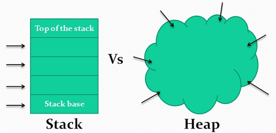

# Rust as an alternative to C and C++


## Use-After-Free
```c++
#include <iostream>
#include <string>

class Dog {
    std::string mName;
public:
    Dog(const char* name) {
        mName = std::move(name);
    }

    void bark() {
        std::cout << "Wuff!" << std::endl;
    }
};

int main() {
    Dog *snuffles = new Dog("Snuffles");

    delete snuffles; // RIP
    
    snuffles->bark();
}
```

## Buffer overflow
```c++
#include <iostream>
#include <cstring>

int main() {
    int auth = 0;
    char password[10];
    std::cout << "Password: ";
    std::cin >> password;

    if (strcmp(password, "secret!") == 0) {
        auth = 1;
    } else {
        std::cout << "Wrong password!" << std::endl;
    }

    if (auth) {
        std::cout << "Logged in!" << std::endl;
    }
}
```

## Type Safe Languages
> Practitioners who invented type safety often meant just **“memory integrity”**, while theoreticians always meant **“execution integrity”**, and it is the latter that seems more relevant now
* Static and runtime checks
* Array bounds checking
* Garbage collection

# What is Rust?

## Goals
> Take, for example, **“systems-level” work** that deals with low-level details of **memory management, data representation, and concurrency**. Traditionally, this realm of programming is seen as arcane, accessible only to a select few who have devoted the necessary years learning to **avoid its infamous pitfalls**. And even those who practice it do so with caution, lest their code be open to **exploits, crashes, or corruption**.
* Eliminate pitfalls
* Friendly and polished set of tools
* "Dip down" into lower level, **without** taking unnecessary risks of crashes and **security holes**
* Reliable, efficient and memory efficient code
* Low risk parallelism
* Coding **with** the compiler and not against it

## Domain
* System programming (Drivers, Operating systems, etc.)
* Embedded systems
* Compiler
* Browser
* Multimedia (Codecs etc.)
* **Web Servers**
* **Business Applications**

## History
* 2006 Personal project of Mozilla employee Graydon Hoare
* 2009 Mozilla began sponsoring the project
* 2011 Rust compiler compiled itself
* 2012 Pre-Alpha release
* 2015 First stable release

## Who uses Rust?
TODO

## Ecosystem
* Open-Source  
TODO

## Hello World
```rust
fn main() {
    println!("Hello, world!");
}
```
```sh
cargo new hello_world
cd hello_world
cargo run
```

# Agenda
* Introduction
* Basics
* Ownership and borrowing
* Structs and enums
* Traits
* OOP in rust
* Integrating C/C++ libraries into Rust

# Basics
## Variables
```rust
let truth: u8 = 42;
let mut mutable_truth: u8 = 21;
mutable_truth *= 2;
```

## Control flow
```rust
let answer = 42;
if answer == 42 || answer == 21 {
    println!("The answer is the truth: {}!", answer);
} else if answer == 2 || answer == 3 || answer == 7 {
    println!("The answer is part of the truth: {}", answer);
} else {
    println!("Wrong, just wrong");
}
```

## Functions
```rust
fn compute_length(input: &str) -> usize {
    input.len()
}
```

# Ownership
> Ownership is Rust’s most unique feature, and it enables Rust to make memory safety guarantees without needing a garbage collector.  
> 1. Each value in Rust has a variable that’s called its owner.
> 2. There can only be one owner at a time.
> 3. When the owner goes out of scope, the value will be dropped.

## Stack vs. Heap


## Example: C++ vs. Rust
### C++: dog2 is an alias for dog1
```c++
int main() {
    std::string *dog1 = new std::string("Snuffels");
    std::string *dog2 = dog1;

    std::cout << "Dog 1: " << *dog1 << " (" << &dog1 << ") " << std::endl;
    std::cout << "Dog 2: " << *dog2 << " (" << &dog2 << ") " << std::endl;

    delete dog1;
}
```


### Rust: dog2 takes ownership of dog1 (Similar to Resource Acquisition Is Initialization (RAII))
```rust
fn main() {
    let dog1 = String::from("Snuffles");
    let dog2 = dog1;

    println!("Dog 1: {} / Dog 2: {}", dog1, dog2);
}
```


### C++: dog2 takes ownership of dog1
```c++
int main() {
    std::string dog1 = "Snuffels";
    std::string dog2 = std::move(dog1);

    std::cout << "Dog 1: " << dog1 << " (" << &dog1 << ") " << std::endl;
    std::cout << "Dog 2: " << dog2 << " (" << &dog2 << ") " << std::endl;
}
```

## Functions
```rust
fn say_name(name: String) {
    prinln!("{}", name);
}

fn main() {
    let name = String::from("Snuffles");
    say_name(name);
    println!("say_name was called with: {}", name);
}
```

```c++
void say_name(std::string &&name) {
    std::cout << name << std::endl;
}

int main() {
    std::string *dog1 = new std::string("Snuffels");
    std::string *dog2 = dog1;

    say_name(std::move(*dog1));
    say_name(std::move(*dog2));

    std::cout << "Dog 1: " << *dog1 << " (" << &dog1 << ") " << std::endl;
    std::cout << "Dog 2: " << *dog2 << " (" << &dog2 << ") " << std::endl;

    delete dog1;
}
```

# References & Borrowing
> * At any given time, you can have either one mutable reference or any number of immutable references.
> * References must always be valid.

## Passing a variable to a function without loosing ownership
```rust
fn calculate_length(s: &String) -> usize {
    s.len()
}

fn main() {
    let s1 = String::from("hello");

    let len = calculate_length(&s1);

    println!("The length of '{}' is {}.", s1, len);
}
```


## Explicit mutability instead of implicit mutability
```rust
fn main() {
    let mut s = String::from("hello");

    change(&mut s);
}

fn change(some_string: &mut String) {
    some_string.push_str(", world");
}

```

## Either one mutable refrence or many immutable references
### Prevent data races at compile time!
```rust 
fn main() {
    let mut s = String::from("hello");

    let r1 = &mut s;
    let r2 = &mut s;

    println!("{}, {}", r1, r2);
}
```

### Anyone who is reading a value would not expect the value to suddenly change
```rust
fn main() {
    let mut s = String::from("hello");

    let r1 = &s; // no problem
    let r2 = &s; // no problem
    let r3 = &mut s; // BIG PROBLEM

    println!("{}, {}, and {}", r1, r2, r3);
}
```

## Dangling References
### C++: Will compile just fine
```c++
int main() {
    int *answer;
    {
        int calc_answer = 2*3*7;
        answer = &calc_answer;
    }
    std::cout << "Address of answer: " << answer << std::endl;
    std::cout << "Answer is: " << *answer << std::endl;
}
```

### Rust: Will complain during compilation
```rust
fn dangle() -> &String {
    let s = String::from("hello");
    &s
}

fn main() {
    let reference_to_nothing = dangle();
}
```

# Structured Objects
```rust
pub struct Issue {
    pub id: u32,
    pub priority: IssuePriority,
    pub title: String,
    pub description: String,
    pub sub_tasks: Vec<String>
}

impl Issue {
    pub fn set_priority(&mut self, new_priority: IssuePriority) {
        self.priority = new_priority.to_owned();
    }
}

impl Default for Issue {
    fn default() -> Issue {
        Issue {
            id: 1,
            priority: IssuePriority::Bug,
            title: "".to_string(),
            description: "".to_string(),
            sub_tasks: vec![]
        }
    }
}
```

# Enumerations
> Rust’s enums are most similar to **algebraic data types** in functional languages, such as F#, OCaml, and Haskell.

## Example: IssuePriority
```rust
enum IssuePriority {
    Enhancement,
    Bug,
    TODO,
    Milestone(u8)
}

fn main() {
    let mut milestone = Issue::default();
    milestone.set_priority(IssuePriority::Milestone(42));
}
```

## Option enum
### The Billion-dollar mistake
> I call it my billion-dollar mistake. At that time, I was designing the first comprehensive type system for references in an object-oriented language. My goal was to ensure that all use of references should be absolutely safe, with checking performed automatically by the compiler. But I couldn’t resist the temptation to put in a null reference, simply because it was so easy to implement. This has led to innumerable errors, vulnerabilities, and system crashes, which have probably caused a billion dollars of pain and damage in the last forty years.

### Rust does not have **null**
```rust
enum Option<T> {
    Some(T),
    None,
}
```
> Generally, this helps catch one of the most common issues with null: assuming that something isn’t null when it actually is.

* Improves confidence in the code

## Other enums: Result
### Explicit error handling
```rust
enum Result<T, E> {
    Ok(T),
    Err(E),
}
```

## Pattern matching
### Match Control Flow Operator
```rust
fn print_issue_priority(priority: IssuePriority) {
    match priority {
        IssuePriority::Enhancement => println!("Enhancement!"),
        IssuePriority::Bug => println!("Bug!"),
        IssuePriority::Milestone(number: u8) => println!("Milstone #{}!", number),
        _ => println!("TODO!"),
    }
}
```

### Functions
```rust
fn compute_length(&input: &String) -> usize {
    input.len() // Input is of the type 'String'
}
fn compute_length(input: &String) -> usize {
    input.len() // Input is of the type '&String'
}
```

# Traits
> Traits are similar to a feature often called interfaces in other languages, although with some differences.

## Example: Issue
```rust
pub trait Summary {
    fn summarize(&self) -> String;
}

impl Summary for issue {
    fn summarize(&self) -> String {
        format!("{}: {}", self.id, self.title)
    }
}
```

## Default implementations
```rust
pub trait Summary {
    fn summarize(&self) -> String {
        String::from("(Read more...)")
    }
}
```

## Traits as parameters
```rust
pub fn notify(item: impl Summary + Clone) {
    println!("Breaking news! {}", item.clone().summarize());
}
```

## Returning Types that implement traits
```rust
fn returns_summarizable() -> impl Summary {
    Issue::default()
}
```

# OOP in Rust
> Many competing definitions describe what OOP is; some definitions would classify Rust as object oriented, but other definitions would not.

## Objects hold data and define procedures that operate on that data and **encapsulation** that hides implementation details
```rust
pub struct SomeTuple {
    a: u32,
    b: u32
}

impl SomeTuple {
    pub fn sum(&self) -> u32 {
        self.get_a() + self.get_b()
    }

    fn get_a(&self) -> u32 {
        self.a
    }

    fn get_b(&self) -> u32 {
        self.b
    }
}
```

## Inheritance as a Type System and as Code Sharing
> Inheritance is a mechanism whereby an object can inherit from another object’s definition, thus gaining the parent object’s data and behavior without you having to define them again.

> If a language must have inheritance to be an object-oriented language, then Rust is not one.

### Inheritance form of poor design choice
* Risk of sharing more code than necessary.
* Subclasses shouldn't always share all characteristics

### Polymorphism
> To many people, polymorphism is synonymous with inheritance. (...)

> Rust instead uses generics to abstract over different possible types and trait bounds to impose constraints on what those types must provide. This is sometimes called **bounded parametric polymorphism**.

## Trait objects
> Define a trait for **common** behavior.

### Example GUI components
```rust
pub trait Draw {
    fn draw(&self);
}

pub struct Screen {
    pub components: Vec<Box<dyn Draw>>,
}

impl Screen {
    pub fn run(&self) {
        for component in self.components.iter() {
            component.draw();
        }
    }
}
```

### Implementing the trait for components
```rust
pub struct Button {
    pub width: u32,
    pub height: u32,
    pub label: String,
}

impl Draw for Button {
    fn draw(&self) {
        // code to actually draw a button
    }
}
```

### Executing the code
```rust
use gui::Button;

fn main() {
    let screen = Screen {
        components: vec![
            Box::new(Button {
                width: 50,
                height: 10,
                label: String::from("OK"),
            }),
        ],
    };

    screen.run();
}
```


# Sources
* https://www.rust-lang.org/
* https://en.wikipedia.org/wiki/Rust_(programming_language)
* https://github.com/rust-lang/book
* https://techdifferences.com/difference-between-stack-and-heap.html