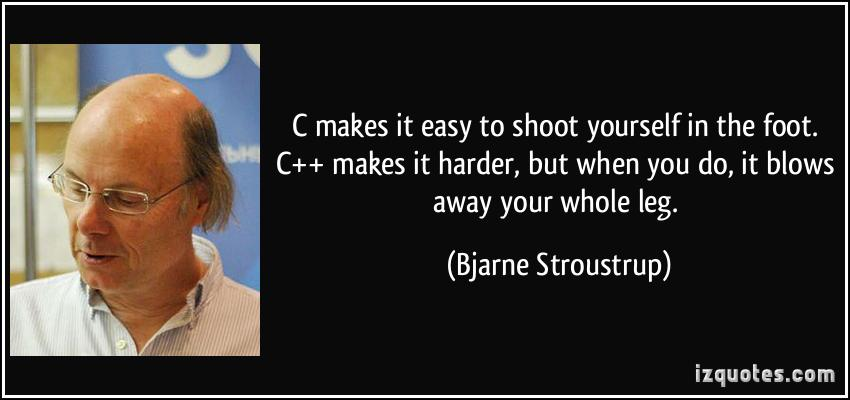

# Introduction


## Use-After-Free
```c++
#include <iostream>
#include <string>

class Dog {
    std::string mName;
public:
    Dog(const char* name) : mName(name) {}

    void bark() {
        std::cout << "Wuff!" << std::endl;
    }
};

int main() {
    Dog *snuffles = new Dog("Snuffles");
    delete snuffles; // RIP
    snuffles->bark();
}
```

## Buffer overflow
```c++
#include <iostream>
#include <cstring>

int main() {
    int auth = 0;
    char password[10];
    std::cout << "Password: ";
    std::cin >> password;

    if (strcmp(password, "secret!") == 0) {
        auth = 1;
    } else {
        std::cout << "Wrong password!" << std::endl;
    }

    if (auth) {
        std::cout << "Logged in!" << std::endl;
    }
}
```

## Type Safe Languages
> Practitioners who invented type safety often meant just **“memory integrity”**, while theoreticians always meant **“execution integrity”**, and it is the latter that seems more relevant now
* Static and runtime checks
* Array bounds checking
* Garbage collection

# What is Rust?

## Goals and core values
> Take, for example, **“systems-level” work** that deals with low-level details of **memory management, data representation, and concurrency**. Traditionally, this realm of programming is seen as arcane, accessible only to a select few who have devoted the necessary years learning to **avoid its infamous pitfalls**. And even those who practice it do so with caution, lest their code be open to **exploits, crashes, or corruption**.
* Safety
    * Ownership and borrowing system
    * Type safety
* Performance
    * "[Fearless concurrency](https://doc.rust-lang.org/book/ch16-00-concurrency.html)" - Low risk parallelism
* Productivity
    * Cargo ([Dependency Management](https://wiki.alopex.li/LetsBeRealAboutDependencies), Linting, testing etc.)
    * Crates.io
    * Composability
    * Helpful error messages (HUGE)
    * Significantly [easier](https://www.youtube.com/watch?v=VSlBhAOLtFA) to [learn](http://static.fjcdn.com/pictures/Learn+c+in+21+days_7ee339_3181601.jpg)

## Technical bits
* Compiled language
* Strong, static typing
* Imperative, but with functional aspects
* No garbage collection or runtime
    * No reflection
    * No runtime-aided debugging
* Powerful and strict type system
    * TODO: You have to handle errors

## Domain
* System programming (Drivers, Operating systems, etc.)
* Embedded systems
* Compiler
* Browser
* Multimedia (Codecs etc.)
* **Web Servers**
* **Business Applications**

## History
* 2006 Personal project of Mozilla employee Graydon Hoare
* 2009 Mozilla began sponsoring the project
* 2011 Rust compiler compiled itself
* 2012 Pre-Alpha release
* 2015 First stable release

## Who uses Rust?
* Firefox: Servo Browser Engine
* Dropbox
* Cloudflare
* NPM

## Ecosystem
* Open-Source (https://github.com/rust-lang)
* Crates.io (Package manager)
* Fully backwards compatible
* Cargo (Unified build system)
* Community driven development
* Very good documentation

## Hello World
```rust
fn main() {
    println!("Hello, world!");
}
```
```sh
cargo new hello_world
cd hello_world
cargo run
```