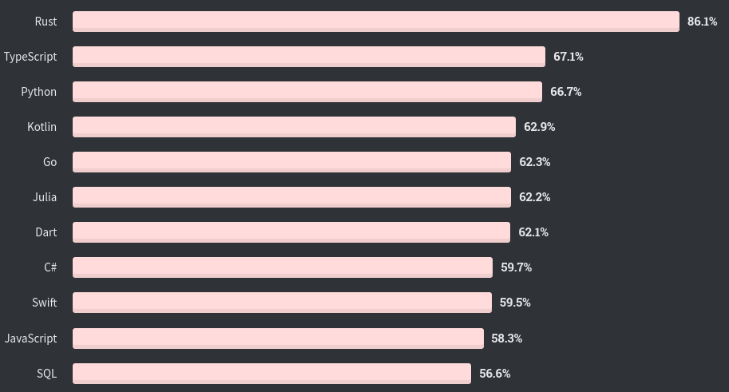

---
presentation:
  theme: league.css
  margin: 0.1
  enableSpeakerNotes: true
---

<!-- slide -->
<aside class="notes">
Today I want to show you Rust. A young programming language that captured my heart.
</aside>

# RUST

@import "images/logo.png"{height="450px"}

<!-- slide -->
<aside class="notes">
Rusts first stable release was 2015 and since 2016 it is the most loved programming language according to the annual Stackoverflow survey
</aside>

## Most loved language

@import "images/so_survey/so_survey_2016.png"{height="250px"}
@import "images/so_survey/so_survey_2017.png"{height="250px"}
@import "images/so_survey/so_survey_2018.png"{height="250px"}
@import "images/so_survey/so_survey_2019.png"{height="250px"}

<!-- slide -->
<aside class="notes">
According to the official website of Rust and the community, Rust stands on 4 integral pillars:
Community
Productivity
Reliability and
Performance

In the following I will give a brief examples for each pillar and at end we jump into a demo to see Rust live and in action.
</aside>

## What's so charming?

Community
Productivity
Reliability
Performance

<!-- slide -->
<aside class="notes">
I love Rust and I could talk days about it, so I had a hard time deciding what to say and what not. So instead of doing it alone, I opted to ask the community instead and within a day I already had over 50 constructive suggestions.

Here I chose Reddit to get in contact with the community, but they are also this nice on GitHub and even StackOverflow. 
</aside>

## Community

@import "images/community/reddit.png"

<!-- slide -->
<aside class="notes">
Rust is open source

Every new feature goes through an intensive RFC process, where its discussed and tuned until it is either accepted or rejected by the community.

Therefore, Rust is very transparent in its changes and development.
</aside>

## Open source

@import "images/community/github.png"

<!-- slide -->
<aside class="notes">
There is a huge amount of learning ressources ranging from beginner level, via expert level to black magic.

The official Rust website provides plenty of free learning ressources and documentation but there are also very good external sources which were created by the community.
</aside>

## Learning ressources

@import "images/community/ressources_1.png"{width="400px"}
@import "images/community/ressources_2.png"{width="400px"}
@import "images/community/ressources_3.png"{width="400px"}
@import "images/community/ressources_4.png"{width="400px"}

<!-- slide -->
<aside class="notes">
One tool to rule them all - The language not only comes with the compiler but also with an build system, package registry and a language server.
</aside>

## One tool to rule them all

@import "images/productivity/cargo.jpg"

<!-- slide -->

## Cargo
<aside class="notes">
The build system Cargo provides not only a nice way of building your application but also unifies other needs such as

Documentation generation from the source code, that can later be used for the hand over or if it is an library as a documentation for the library.

Dependency Management, just tell Cargo which version of which crate you would like to have and Cargo does the rest. No need for manual wiring or linking.

Cargo also provides annotations add tests and benchmarks to the test binary and executes them independently.

The Rust language comes with an official style guideline that can be applied to the sourcecode via a simple command and also adjusted to the projects needs.

External components such as Clippy provide linting of code that can be writting in a more idiomatic or efficient way and can easily be integrated as a subcommand in cargo.

Show crates.io
There is a huge eco system of libraries that are well tested and can be easily integrated.
There are efforts such as Awesome Rust to find suitable packages more easily.
</aside>

Documentation

Dependency Management

Testing and Benchmarking

Linting and  Formatting

Huge Eco System, e.g. crates.io

Build System

<!-- slide -->
<aside class="notes">
The compiler is really helpful and verbose and shows you just the information that you need.

Here for example I attempted to use a variable that I had already moved before. This would have compiled in languages like C++ without a warning and led eventually to undefined behavior.
</aside>

## A true friend

@import "images/productivity/compiler.png"

<!-- slide -->
<aside class="notes">
Rust does not have the null value, otherwise known as the billion-dollar mistake. Instead, such a behavior is encoded in algebraic datatypes, similar to the Optional type in Java or the Maybe type in Haskell.

Rust is a type safe language, i.e. memory integrity issues are dealt with at compile time and is still as fast as C and C++.

A report of microsoft shows that 70% of their mission-critical bugs deal with memory safety issues. 

While this is not a problem for normal business applications that use type safe languages as well, as soon as one engages in the embedded domain where memory, energy and runtime efficiency as well as safety and security is integral, one would find himself in the situation having to use low-level languages such as C and C++. And here is where Rust shines, as an alternative. 
</aside>

## Avoiding common pitfalls

> The Billion-dollar mistake

> (...) what we found at Microsoft is that 70% of our very serious, mission-critical bugs (...) deal with memory safety and incorrect usage of memory.

<!-- slide -->
<aside class="notes">
Read technical bits
</aside>

## Technical bits

Compiled Language, no Garbage Collection

Type Safety  (Memory Integrity)

Immutable by default

Ownership System

Strong, Static Typing

Imperative, but functional aspects

<!-- slide -->

# DEMO

<!-- slide -->

## Further reading

> https://www.rust-lang.org/learn

> https://github.com/Geigerkind
